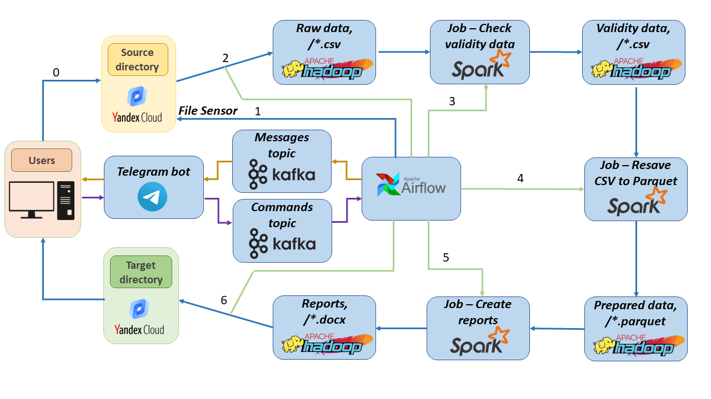
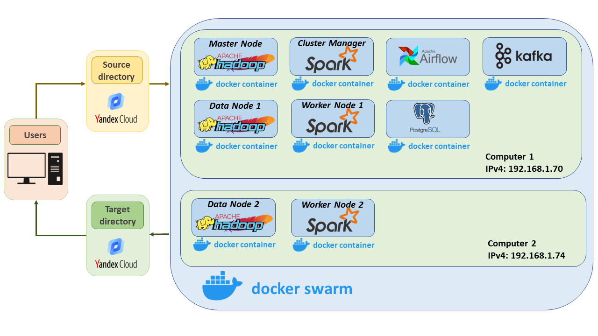

Example of constructing an automated data processing system
===

Project description:
---
It is necessary to prepare a system that automatically monitors a given cloud directory and processes files in it.

0. YandexCloud is used as a cloud directory where the user puts files.
1. FileSensor Airflow monitors the appearance of data in the file system.
2. When the files appear, they are re-saved to the HDFS file system and the next DAG is triggered.
3. Airflow launches a Job that performs data validation.
4. Airflow launches a Job that preprocesses the data and resaves it in binary format.
5. Airflow starts a Job that generates a report of the prescribed form.
6. Airflow sends report to user.

At each step, Airflow sends a message to the appropriate kafka topic. Messages from a Kafka topic are sent to the user through a telegram bot.

The user can send commands to launch individual DAGs via the Telegram bot.

___

Project schema:
---
All services are deployed in docker containers. Each container is deployed on the docker-swarm network. The docker-swarm network is deployed on two separate computers on the same local network.

Source and target file directories are directories on Yandex Cloud. To access containers, they are mounted as the file directory of the Airflow and Hadoop containers.

___

Deployment: 
---
0. Rename the file <example_env> to <.env> and specify the correct parameters in each directory.
1. Docker network creation
    - On **host-1** 
    ~~~
    sudo ufw enable
    sudo ufw allow 2377/tcp && sudo ufw allow 7946/tcp && sudo ufw allow 7946/udp && sudo ufw allow 4789/udp

    docker swarm init

    docker network create --driver=overlay --attachable main-overlay-network
    ~~~
    - On **host-2**
    ~~~
    sudo ufw enable
    sudo ufw allow 2377/tcp && sudo ufw allow 7946/tcp && sudo ufw allow 7946/udp && sudo ufw allow 4789/udp

    docker swarm join --token <TOKEN> --advertise-addr <IP-ADDRESS-OF-WORKER-1>  <IP-ADDRESS-OF-MANAGER>:2377
    ~~~

    For more information see: 
    - https://docs.docker.com/network/overlay/
    - https://docs.docker.com/network/network-tutorial-overlay/#use-an-overlay-network-for-standalone-containers

2. Depoyment of a Postgres container in the created network on **host-1**
~~~
docker-compose -f postgress/docker-compose.yaml up -d
~~~
3. Creating a database and a user in Postgres for Airflow backend.
~~~
docker exec -it postgres bash
psql -U postgres

CREATE USER airflow;
ALTER USER airflow WITH PASSWORD 'airflow';
CREATE DATABASE airflow;
GRANT ALL PRIVILEGES ON DATABASE airflow TO airflow;

exit
~~~
4. Depoyment of a Airflow container in the created network on **host-1**
~~~
docker-compose -f airflow/docker-compose.yaml up -d
~~~
5. Depoyment of a Hadoop Master Node and Hadoop Worker Node 1 container in the created network on **host-1**
~~~
docker-compose -f hadoop/hadoop-master.yaml up -d
~~~
6. Depoyment of a Hadoop Worker Node 2 container in the created network on **host-2**
~~~
docker-compose -f hadoop/hadoop-slave.yaml up -d
~~~
7. Depoyment of a Hadoop Manager container in the created network on **host-1**
~~~
docker-compose -f hadoop/hadoop-manager.yaml up -d
~~~
8. Depoyment of a Spark Master Node and Spark Worker Node 1 container in the created network on **host-1**
~~~
docker-compose -f spark/spark-master.yaml up -d
~~~
9. Depoyment of a Spark Worker Node 2 container in the created network on **host-2**
~~~
docker-compose -f spark/spark-slave.yaml up -d
~~~
10. Depoyment of a Kafka container in the created network on **host-1**
~~~
docker-compose -f kafka/docker-compose.yaml up -d
~~~
11. Open the Airflow interface and launch the DAGs.
___

Interfaces:
---

- Airflow: http://localhost:8080/home 
- Hadoop: http://localhost:9870/dfshealth.html#tab-overview
- Spark: http://localhost:8090/

___

Project Organization
---

    ├── README.md
    │
    ├── airflow
    │   ├── docker-compose.yaml
    │   ├── Dockerfile
    │   ├── requirements.txt
    │   ├── example_env
    │   │
    │   ├── dags
    │   │
    │   ├── logs 
    │   │
    │   └── plugins
    │ 
    ├── postgres  
    │   ├── docker-compose.yaml
    │   ├── postgres.conf 
    │   ├── example_env
    │   │
    │   └── data 
    │
    ├── hadoop    
    │   ├── hadoop-manager.yaml
    │   ├── hadoop-master.yaml
    │   ├── hadoop-slave.yaml
    │   ├── requirements.txt
    │   ├── example_env 
    │   │
    │   └── hadoop-data 
    │
    ├── spark    
    │   ├── spark-manager.yaml
    │   ├── spark-master.yaml
    │   ├── Dockerfile
    │   ├── master.sh
    │   ├── example_env 
    │   │
    │   └── spark-data 
    │ 
    ├── kafka  
    │   ├── docker-compose.yaml
    │   │
    │   ├── kafka-data
    │   │
    │   └── zookeeper-data 
    │
    └── .gitignore

---
